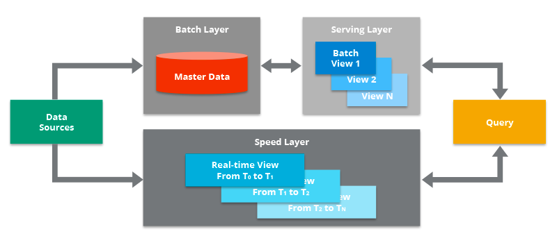

# Data Engineering Lesson Learn
This is collection of projects, practices in data engineering foundation

## Introduction & Goals
- Summary fundamental skills, knowledge of a Data Engineer.
- Strengthen theory by practical exercises.

## Table of contents
- [Data engineering foundations](#def)
- [Python for data engineer](#py4de)
- [Platform and Pipeline design foundations](#platform&pipelinedesign)
- [Fundamental tools](#fundamentaltools)

## Data engineering foundations 
- Diagrams:
  - UML diagram
  - Sequence diagram
- Source version control:
  - Github
  - Gitlab
- [Agile](https://www.visual-paradigm.com/guide/uml-unified-modeling-language/uml-class-diagram-tutorial/)
  - Roles:
    - Product owner
    - Development team
    - Scrum master
  - Activities:
    - Sprint retro
    - Sprint planning
    - Daily scrum
    - Sprint review
- [DevOps](https://intland.com/codebeamer/devops-it-operations/)
- [SRE](https://sre.google/books/)
- [OLAP vs OLTP](https://www.guru99.com/oltp-vs-olap.html)
- Relational database and SQL are important
- [Data modeling](https://www.guru99.com/data-modelling-conceptual-logical.html)
- [ER model](https://www.tutorialspoint.com/dbms/er_model_basic_concepts.htm)
  - Entity:
    - Entity set
    - Keys:
      - Super key
      - Candidate key
      - Primary key
  - Attributes:
    - Simple attribute
    - Composite attribute
    - Derived attribute
    - Single-value attribute
    - Multi-value attribute
  - Relationship:
    - Relationship set (descriptive attributes)
    - Degree of relationship
      - Binary = degree 2
      - Ternary = degree 3
      - n-ary = degree n
    - Mapping cardinalities
      - One-to-one
      - One-to-many
      - Many-to-one
      - Many-to-many
- [Normalization](https://www.edureka.co/blog/normalization-in-sql/)
  - 1NF, 2NF, 3NF, 4NF
- Primary key and Foreign key
- Building a data model with [dbdiagram.io](https://dbdiagram.io/d)
- Computer networking:
  - Networking basic
  - IP address and subnet mask
  - IP routing
  - Vlans
  - Access control list
  - VPN
  - Ports
  - TCP/UDP
  - Public/private key exchange/ security explained
  - Security Certificate & CAs
- Linux:
  - Important directories /var/log /var/opt /etc /tmp
  - Copy and move data
  - Cronjobs
  - Vi/vim/nano visual editors on command line
  - Bash/shell script
  - Permission
- REST API
  - [API design](https://cloud.google.com/apis/design)
  - [Swagger](https://swagger.io)

## Python for data engineer 
- Advanced Python:
  - Class
  - Modules
  - Exception handling
  - Logging
- Data engineering
  - Work with Datetime format
  - Work with JSON format
    - Load, dump
    - Serialize, deserialize with Pydantic
    - Validation with [json-schema](https://json-schema.org/draft/2020-12/json-schema-validation.html#name-introduction), [syntax](https://opis.io/json-schema/2.x/formats.html#:~:text=invalid-,date%2Dtime,%3A%3ADDThh%3Amm%3Ass.)
  - Testing
    - [pytest structure](https://blog.methodsconsultants.com/posts/pytesting-your-python-package/)
  - **Pandas**:
    - Read from csv
    - Working with data types
    - Reading from JSON
    - Appending dataframes
    - Merging dataframes
    - Pivoting dataframes
    - Saving and reading parquet
    - **Melting and normalization (JSON)**
    - Average, min, max of columns in dataframe
    - Add random value to dataframe
  - Work with data source/sink
    - Work with REST API
    - Work with database
      - Setup
      - Table
      - Bulk load
      - Query

## Platform and Pipeline design foundations 
  - The platform blueprint
    - Sources
      - External API
      - External data warehouse
      - External SQL/No-SQL database
    - Temporary storage - buffer
      - Cache
      - Message queue
    - Processing
      - Batch processing
      - Stream processing
    - Persistence storage
      - SQL database
      - No-SQL database
      - DWH
      - OLAP
  - Ingestion pipelines
    - Push ingestion pipeline
    - Pull ingestion pipeline
  - Batch pipelines
    - Store
    - Processing framework (ELT/ELT)
    - Scheduling
    - Workflow orchestration
  - Stream pipelines
    - For ingestion purpose (push ingestion pipeline)
    - Stream analytic
      - Seed only small window
      - Immediately processing
      - Preprocessing on the fly
      - Push result to
        - Buffer
        - Storage
  - [**Lambda architecture**](https://hazelcast.com/glossary/lambda-architecture/)
    - Kafka -> Spark streaming -> [Store 1 for batch, Store for stream]
    - Airflow -> Spark processing/Python script -> Store 1 -> Store 2
    - Dashboard -> Store 2
    
  
  - [**Kappa architecture**](https://hazelcast.com/glossary/kappa-architecture/)
    

  - Data visualization pipelines
    - Data store
      - Operational database
      - No-SQL database
      - Data warehouse
    - Visualization tools (BI tools, Web UI, Dashboard)
    - API access data from store
    - Open-gateway data publish to subscribers
  - Machine learning pipelines
  - Platform in cloud (AWS, Azure, GCP)

## Fundamental tools 
- [Docker](https://www.docker.com/) fundamentals
- [Kubenestes](https://kubernetes.io/) fundamentals
- Design API with [FastAPI](https://fastapi.tiangolo.com/)
- Data-intensive and sharable web-app with [Streamlit](https://streamlit.io/)
- Apache Spark fundamentals
- Apache Kafka
- Apache Airflow
- MongoDB fundamental
- Modern data warehouses & data lakes
- Log analysis with Elasticsearch
